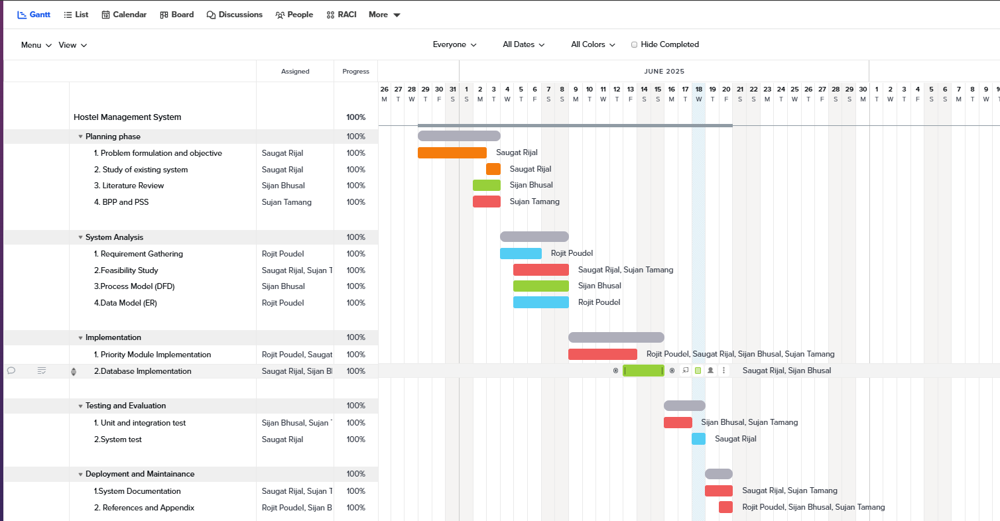
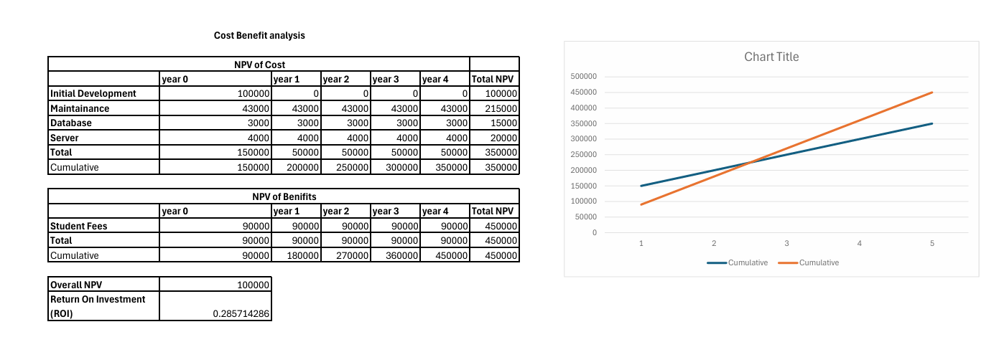

## Schedule feasibility

The above gantt chart showcases the schedule feasibility of our project
Hotel Management System. The project started with a planning phase where
we formulated the problem and determined the objectives of the project.
After that we studied the existing system, we reviewed the literature
for the project and we created the Baseline Project Plan (BPP) and
the Project Scope Statement (PSS).

This marked the end of the planning phase. After that we proceeded to
the analysis phase where we gathered the requirements of the project.
We studied the feasibility, we created the process model (which is the DFD)
and the data model (which is the ER) simultaneously.

The implementation phase included creating priority modules and
databases and connecting them together for the final software.

After that we proceeded to the testing and evaluation phase where we
tested the system as individual modules in unit testing and integration of
modules in the integration testing. We also tested the system as a whole
under different operating systems.

After the testing and evaluation phase was completed and when we had
the confidence in the final product, we documented the system,
we referenced the sources, created the appendix for the project
and finally deployed the project.

## Technical feasibility

After a very long deliberation on what the capabilities of the current team
members were and what the technologies that could be learnt in the given
time frame were, we decided on the tools and technologies that would be the
most convenient for the current state of the team.

This laid us to choosing the following tools:

**_Version control tools:_**
Git, Github

**_Programming languages:_**
JavaScript, HTML, CSS, etc.

**_Libraries:_**
Expressjs, reactjs, prisma, etc.

**_Testing:_**
jest, vitest for unit testing.
postman, curl, httpie etc.

**_Database tools:_**
postgresql

Furthermore, as the project went on,
The team members learned the new tools and
technologies needed for the completion of the project.

## Operational feasibility

Since we have not found any system similar to the system
that we are going to implement for the current hostel,
there should be no problems regarding integrating the
current system with the existing system.

And furthermore, since the requirements were gathered after
asking various questionnaires and after many interviews with
the wholesale owners and the hostellers, the system is well
suited to be operated in the real world according to the
requirements.

We also considered the training required for the hostel staff
to operate the final system and concluded that since hostel
staff have basic understanding of how to use a computer a
smartphone and web applications, we concluded that our web
based hostel management system will be operationally feasible.

## Economic feasibility

The estimation for economic feasibility was was determined by calculating
the break even point and the return on investment for the project.

For calculating the cost for the project we estimated at the net present
value of cost for the initial development (i.e. the one time cost) will
be around 1 lakh rupees.
All the costs for maintenance, database, server are considered to be
recurring costs.
The npv of costs over the four years will be around 3.5 lakh rupees.

The benefits are mainly generated from the membership fees for the hostel.
Assuming that we have 50 students in the hostel every year and 150 rupees
is paid for the maintenance of the project each month from the fees paid
to the students per student, the NPV of the benefits over the period will
be around 4.5 lakhs.

For the break even analysis, we followed the calculated NPV of costs and
of benefits and found that the break even point is at 2 years and half.
Similarly, return on investment is expected to be around 2.8 or 28%
over the 4 years.
