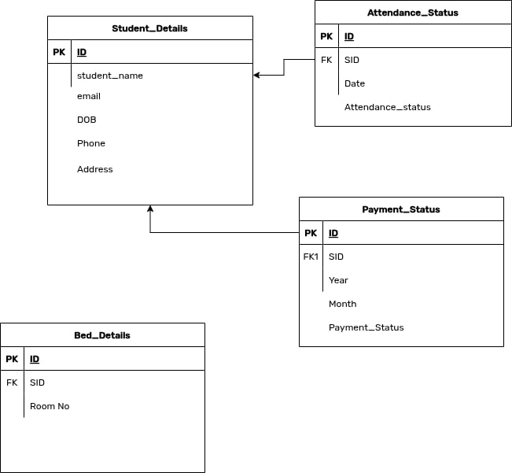
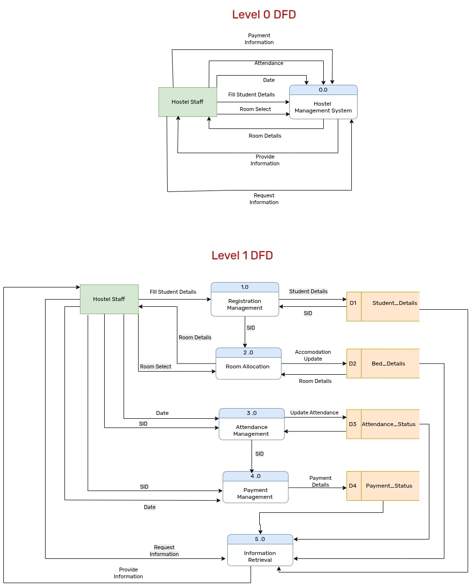

## Architectural Design
### Entity-Relation(ER) Diagram

The ER diagram represents the data structure and relationships for our Hostel Management System:

*Key Entities and Attributes:*
- **Student_Details**
  - SID (Primary Key)
  - Student-name
  - email
  - DOB(Date of Birth)
  - Phone
  - Address
- **Attendance_Status**
  - AID (Primary Key)
  - SID (Foreign Key)
  - Date
  - Attendance_Status (Present/Absent)
- **Payment_Status**
  - PID (Primary Key)
  - SID (Foreign Key)
  - Year
  - Month
  - Payment_Status
- **Bed_Details**
  - BID (Primary Key)
  - SID (Foreign Key)
  - Room_Number

*Relationships:*
- One-to-One: Student to Bed assignment
- One-to-Many: Student to Attendance records
- One-to-Many: Student to Payment records

**2. Data Flow Diagram (DFD)**

The DFD illustrates the system's functional processes and data movements:

*Level 0 DFD (Context Diagram):*
- Represents the entire HMS as a single process.
- Digram doesn't consists of any data storage.
- Shows interaction with external entity (Hostel Staff)
<!-- - Inputs:
  - Fill Student Information
  - Room Selection
  - Student Attendance
  - Payment Transactions
- Outputs:
  - Student Details
  - Room Details
  - Payment Details
  - Attendance Status   Yo rakhna parxa rw??-->
The single process in this diagram is further expaneded into many major process of the system in the next level diagram.

*Level 1 DFD (Decomposed View):*
1. **Registration Management (1.0)**
   - Input: New student information
   - Output: Student ID (SID) generation
   - Data Store: Student_Details

2. **Room Allocation (2.0)**
   - Input: SID and Room Selection
   - Output: Bed assignment
   - Data Store: Bed_Details

3. **Attendance Management (3.0)**
   - Input: SID & Attendance_Date
   - Output: Attendance records
   - Data Store: Attendance_Status

4. **Payment Management (4.0)**
   - Input: SID & Payment_Date
   - Output: Payment confirmation
   - Data Store: Payment_Status

5. **Information Retrieval (5.0)**
   - Input: Staff queries
   - Output: Prvide Information & Records
   - Accesses all data stores

*Data Flow Characteristics:*
- Student ID (SID) serves as the primary key
- Date information is crucial for attendance and payments
- Request-Response pattern for information retrieval

**System Integration Perspective**

The ER diagram and DFD work together to provide a complete system view:
- The ER diagram's entities become data stores in the DFD
- DFD processes manipulate the data defined in the ER diagram
- Relationships in the ER diagram enable data flow between DFD processes

**Implementation Considerations**

Based on these diagrams, our development will focus on:
1. Database Schema Development
   - Creating tables matching ER entities
   - Implementing relationships through foreign keys
   - Establishing constraints and validation rules

2. Process Implementation
   - Building modules for each DFD process
   - Developing data flow interfaces
   - Creating input/output validation

3. Integration Requirements
   - Ensuring seamless data transfer between modules
   - Maintaining data consistency across processes
   - Implementing proper error handling
