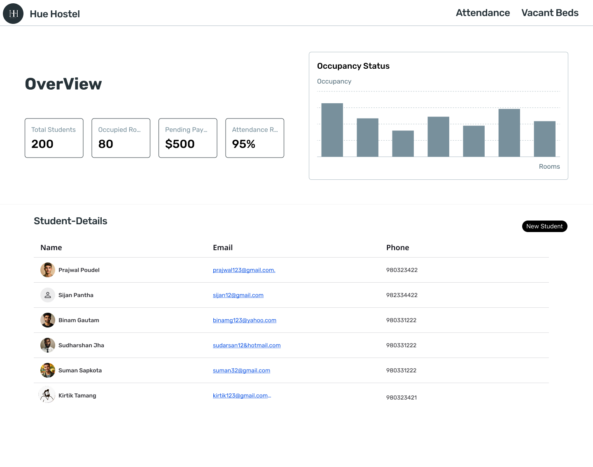
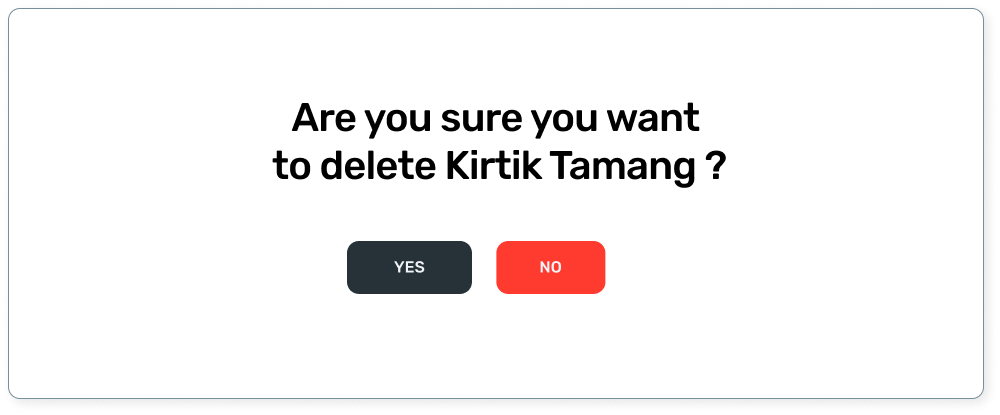

## HMS Workflow

- Dashboard -> New Student -> Student Form
- Dashboard -> View Student -> Student Details
- Student Details -> Payment -> Student Payment Details
- Student Details -> Attendance -> Student Attendance Details
- Student Details -> Edit Student -> Edit Student Page
- Student Details -> Delete Student
- Dashboard -> Attendance -> Today's Attendance
  -Dashboard -> Vacant Beds -> Assign Beds

## Dashboard

The dashboard serves as the main interface, offering an overview of key metrics such as total students, occupied rooms, pending payments, and attendance rates. It also displays a list of students with their basic details like name, email, and phone number. From here, administrators can navigate to various sections of the system, such as adding new students, viewing student details, managing attendance, or assigning beds.

## Add Student

When the "New Student" option is selected from the dashboard, the system redirects to the "Register Student" page. Here, administrators can input the student's first name, last name, email, and phone number. After filling in the details, clicking the "Create" button saves the information and adds the student to the system.

## Student Details

Clicking on a student's name or profile in the dashboard takes the administrator to the "Student Details" page. This page displays comprehensive information about the student, including their name, email, contact number, age, and assigned bed/room number. It also provides options to view payment records, attendance history, edit student details, or delete the student.

## Payment:

Selecting this option navigates to the "Payments of [Student Name]" page, which shows a yearly and monthly breakdown of payment statuses. This helps track whether the student has paid their hostel fees for specific months.

## Attendance:

This option redirects to the "Attendances of [Student Name]" page, displaying daily attendance records. Each day's status (Present/Absent) can be toggled as needed.

## Edit Student:

Clicking this button opens the "Update Student Details" page, where administrators can modify the student's information (e.g., name, email, or phone number) and save changes by clicking "Edit."

## Delete Student:

This action prompts a confirmation dialog ("Are you sure you want to delete [Student Name]?"). If confirmed, the student's record is permanently removed from the system.

## Today's Attendance:

Accessed via the navigation bar, the "Today's Attendance" page lists all students and their attendance status for the current date (e.g., 2025-06-23). Administrators can toggle attendance markers (e.g., Present/Absent) for each student, ensuring accurate daily records.

## Vacant Beds:

This page displays a table of available beds and their corresponding room numbers (e.g., Bed 1 in Room A101). Each entry includes an "Assign" button, which redirects to the "Assign Bed" page when clicked.

## Assign Bed:

On this page, administrators can assign a bed to a specific student. The table lists students' names and emails, with an "Assign" button next to each. Selecting this button likely opens a prompt or interface to link the student to a chosen bed from the vacant beds list.
